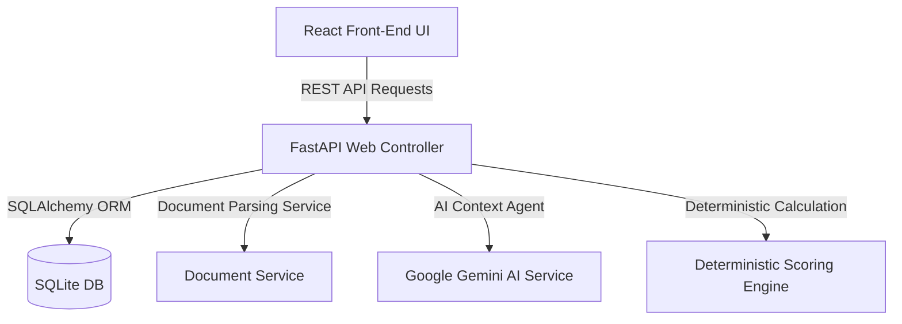
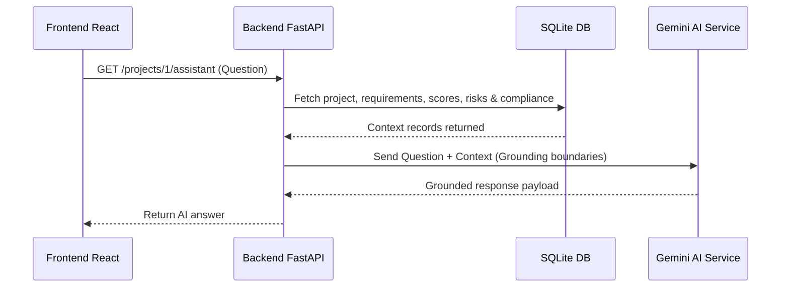

# ProcureLens AI Architecture Specification

This document details the software architecture, design principles, database models, AI Agent pipelines, and scoring logic driving **ProcureLens AI**.

---

## Architecture Overview

ProcureLens AI uses a decoupled client-server architecture. The backend uses Python (FastAPI, SQLite, PyMuPDF, SQLAlchemy), while the frontend uses React (TypeScript, Vite, Tailwind CSS, Recharts).

### Front-End (React, Vite, TS, Tailwind)
- **Landing Page**: Main portal displaying sandbox details and a 1-click **Live Demo** starter.
- **Requirement Builder**: Interface for setting evaluation guidelines, weight categories, and mandatory fields.
- **Proposal Upload**: Upload portal featuring status processing overlays.
- **Project Dashboard**: The primary monitoring dashboard containing champion vendor recommendation summaries, compliance matrices, risk sheets, and decision simulators.
- **AI Assistant**: A chat view providing context-bound QA.

### Back-End (FastAPI, Python)
- **REST Endpoints**: CRUD endpoints for projects, requirements, upload processes, risk maps, recommendations, weights simulation, and chat assistant hooks.
- **Document Service**: Text extraction library integrating PyMuPDF (PDF), python-docx (DOCX), openpyxl (XLSX), and txt decoders.
- **Deterministic Scoring Engine**: Core mathematical module calculating parameter compliance, category performance indexes, risk weights deductions, and mandatory criteria failures.
- **AI Service Abstraction**: Wrapper supporting Gemini API structured outputs and a fully deterministic sandbox `DEMO_MODE` fallback.

---

## Scoring Logic Core

The scoring engine is **100% deterministic** and operates as follows:

1. **Weights Normalization**: Normalizes user weights to equal 100%.
2. **Commercial Price Score**: Matches unit price against target limit. Scales score from 70-100% if within limit, or degrades rapidly if budget is exceeded:
   $$\text{Price Score} = \text{max}(0.0, 70.0 \times (\text{Budget} / \text{Price}) - 20.0)$$
3. **Requirement Compliance Scores**:
   - `MATCH` = 100%
   - `PARTIAL` = 50%
   - `FAIL`/`UNKNOWN` = 0%
4. **Risk Deductions**: Deducts points from 100 based on risk severity:
   - `HIGH` = -30 points
   - `MEDIUM` = -15 points
   - `LOW` = -5 points
5. **Mandatory Fail Penalty**: Subtracts 40 points from the total score if any mandatory requirement fails, guaranteeing non-compliant proposals are penalized.

---

## AI Agent Integration & Grounding

All AI capabilities (proposal extraction, risk analysis, recommendations summary, QA assistant, and negotiation emails) are **grounded in database records**:

- ** Grounding Boundary**: The AI assistant prompt enforces strict context boundaries. If a requested value is not in the context, it returns `UNKNOWN` or `NOT_SPECIFIED`.
- **Structured Contracts**: All extraction tasks use Gemini JSON Mode with validated Pydantic schemas.
